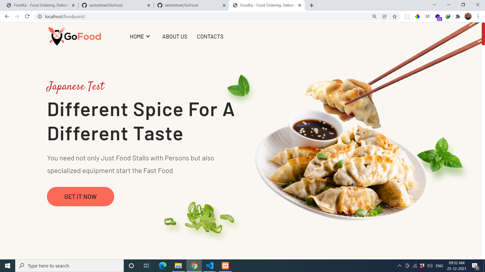
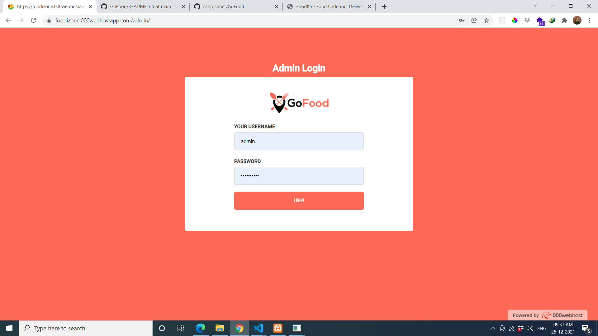
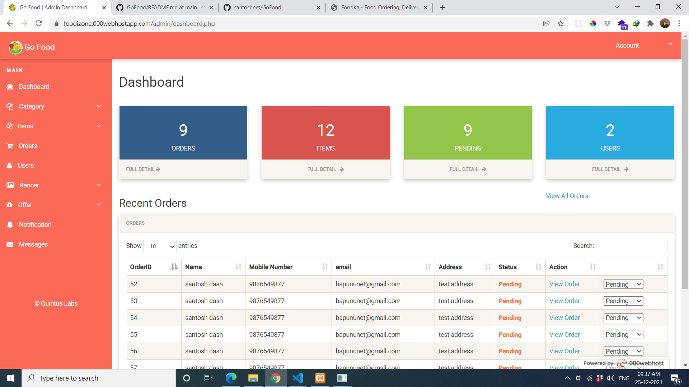
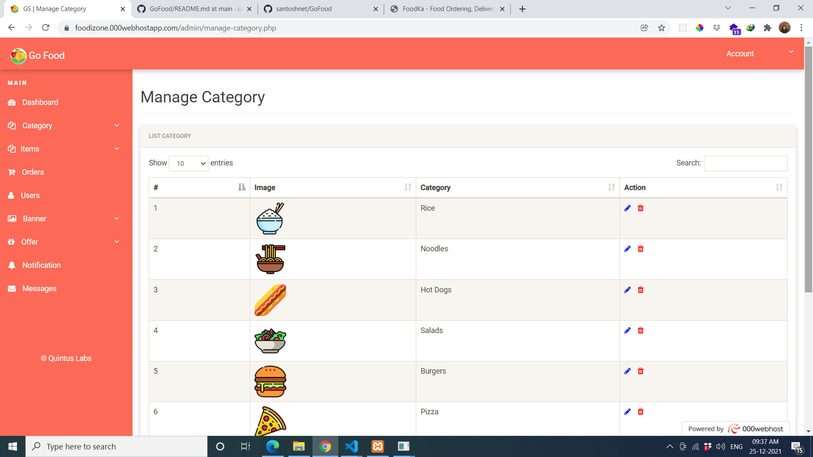
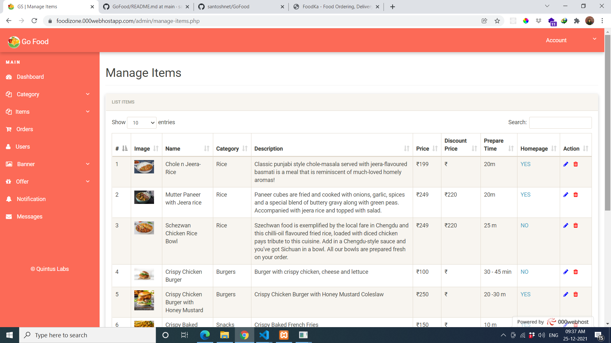
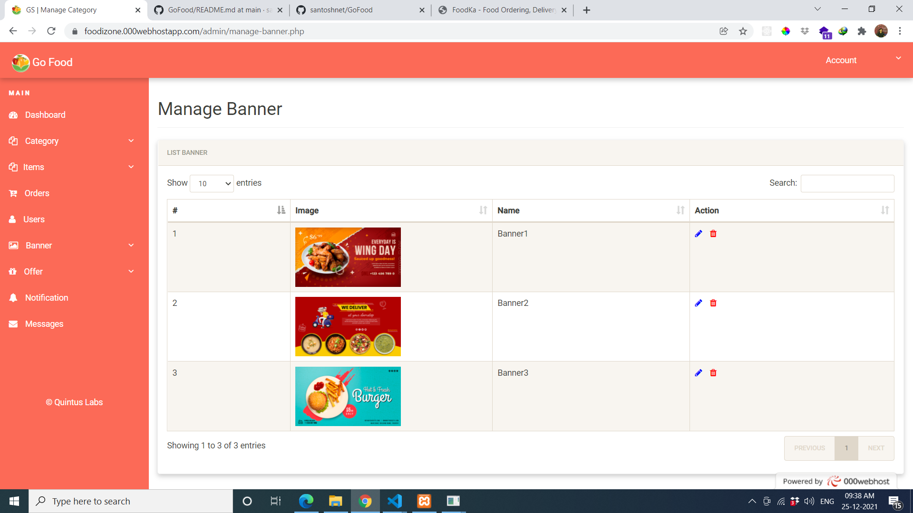
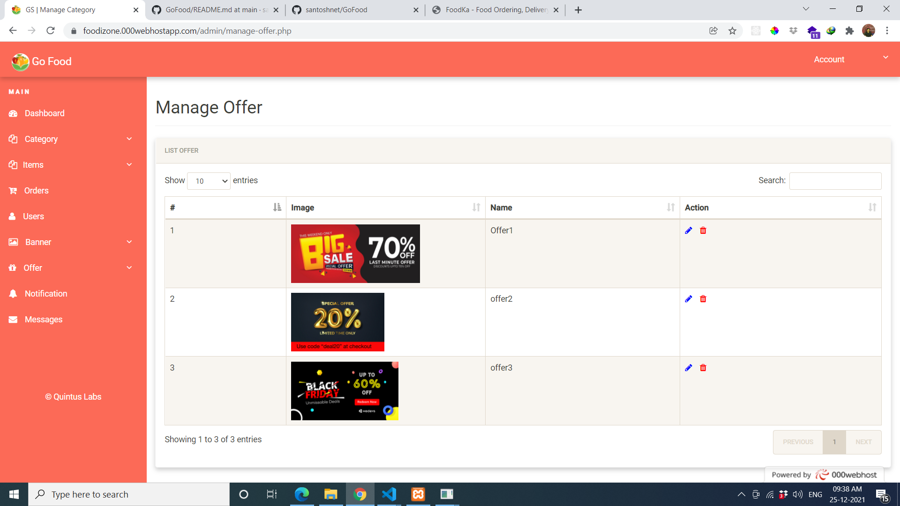

# GoFood
GoFood App, is an online shopping cart application. This is a geniune and native mobile application to which you can rely on, specially when you want to get it done quickly. 
It comprises of 10+ screens with different features to make the navigate smooth & user-friendly.
All the code used, are well organized and layered to make the development precise event for a naive user. Code which is being used to model the application is composed of today's mobile trend. Moreover, one can get free icons, fonts and updates for user's assistance. Changing text, colours and graphics or placing photos will never be a big issue. You can do it with ease. Pixel perfect resolution gives perfect design, while customised elements assist in easy editing.

**Free Features(Android app only)**

- GoFood App Android Template.
- Supported in all Devices.
- Change text, colours and graphics, add or modify photos.
- Customize every element as much, or as little as you want.
- fast searchable product.
- Customise elements (easy to edit).
- 100% free fonts.
- Perfect pixel (high quality design).
- Very clean and cool UI.
- Free updates.
- License.

**Basic Paid Features(with nominal cost)**

- Basic API Integration.
- php with mysql backend.
- Powerful Admin Dashboard.
- Manage Category.
- Manage Items.
- Manage Price.
- Manage Orders (Confirmed, Preparing, On Way, Delivered).
- Manage Customers.
- Token Based Authentication.
- Only COD and offline payment support.

* [GoFood](https://foodizone.000webhostapp.com/) - GoFood Website (Demo)

* [GoFoodAdmin](https://foodizone.000webhostapp.com/admin) - GoFood Admin (Demo)

- username/password for Admin Demo :- admin/Admin@2020

## Android Screen 

## Dashboard Screen

